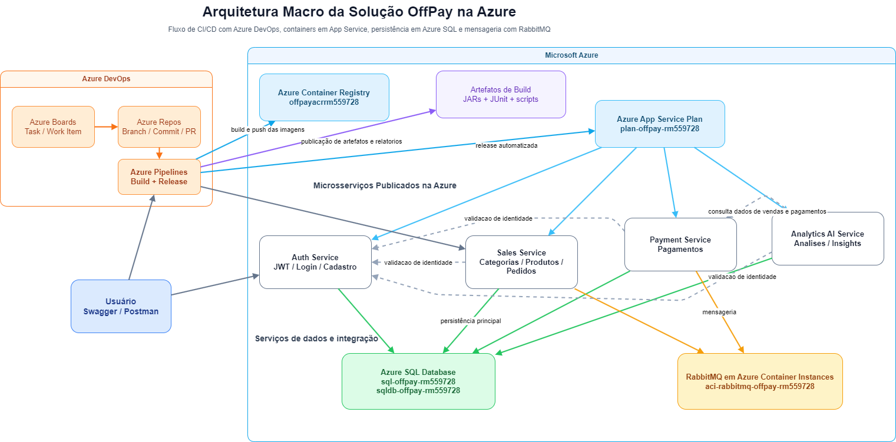

# OFFPAY

Projeto acadêmico orientado a DevOps e cloud para manter a operação de pequenos comércios funcionando mesmo em cenários de instabilidade de rede, usando microsserviços, mensageria, autenticação centralizada e abordagem offline-first.

## Integrantes

- `RM561061` - Arthur Thomas Mariano de Souza
- `RM559873` - Davi Cavalcanti Jorge
- `RM559728` - Mateus da Silveira Lima

## Vídeo Demonstrativo (Integração com o Mobile)
- https://youtu.be/ZMsivlVeczc

## Visão geral

O OffPay foi pensado para reduzir perdas operacionais quando a internet falha durante o fluxo de venda. Em vez de depender de uma conexão estável o tempo todo, a solução separa responsabilidades em microsserviços e mantém a operação da loja com foco em continuidade, sincronização posterior e rastreabilidade.

Os domínios principais da solução são:

- autenticação e identidade
- catálogo, categorias, produtos e pedidos
- carteira e pagamentos
- analytics e insights com IA

## Problema resolvido

Pequenos comércios perdem vendas quando a internet falha no momento do pedido, do pagamento ou da consulta ao catálogo. Isso gera filas, retrabalho, perda de confiança e risco operacional.

O OffPay trata esse problema com uma abordagem offline-first:

- mantém a operação comercial ativa
- registra informações para sincronização posterior
- reduz o impacto de instabilidades de rede
- separa fluxos críticos em serviços independentes

## Objetivos da solução

- permitir que vendedores continuem vendendo mesmo com instabilidade
- sincronizar pedidos, catálogo e eventos quando a conectividade retornar
- registrar pagamentos com rastreabilidade
- manter uma separação clara entre autenticação, operação comercial, pagamentos e analytics
- viabilizar entrega automatizada em nuvem com Azure DevOps

## Microsserviços

| Serviço                       |  Porta | Papel                                                   |
| ----------------------------- | -----: | ------------------------------------------------------- |
| `signal-auth-service`         | `8081` | autenticação, cadastro, login, JWT e identidade         |
| `signal-sales-service`        | `8082` | catálogo, categorias, produtos, pedidos e sincronização |
| `signal-payment-service`      | `8083` | carteira, transações e processamento financeiro         |
| `signal-analytics-ai-service` | `8084` | resumos, gráficos, analytics e insights                 |

## Arquitetura macro

O desenho abaixo representa a arquitetura macro da solução publicada na Azure, incluindo Azure DevOps, Container Registry, App Services, Azure SQL e RabbitMQ.



## Justificativa da arquitetura

A arquitetura de microsserviços foi adotada porque o problema envolve domínios diferentes e responsabilidades que precisam evoluir de forma relativamente independente.

- o `auth-service` centraliza identidade, JWT e segurança
- o `sales-service` concentra o fluxo operacional da loja
- o `payment-service` isola a regra financeira
- o `analytics-ai-service` consolida dados e responde perguntas analíticas

Essa divisão reduz acoplamento, melhora a manutenção e torna a solução adequada para uma entrega DevOps com build, artefatos, imagens Docker e deploy automatizado.

## Recursos técnicos aplicados

- Spring Boot
- APIs REST
- Spring Security com JWT
- Swagger / OpenAPI
- HATEOAS em endpoints selecionados
- RabbitMQ para mensageria
- Feign Client para comunicação entre serviços
- Flyway para versionamento do banco
- Docker e Docker Compose
- Azure DevOps Pipelines
- Azure Web Apps for Containers
- Azure SQL Database
- Azure Container Registry
- Spring AI no serviço de analytics

## Fluxo resumido da solução

1. o usuário se autentica no `signal-auth-service`
2. o vendedor opera categorias, produtos e pedidos no `signal-sales-service`
3. o `signal-payment-service` processa carteira e transações
4. o `signal-analytics-ai-service` consolida dados e gera resumos e insights
5. a entrega em nuvem acontece com build, publicação de artefatos, build e push das imagens e deploy automático na Azure

## Execução local

O repositório deve ser executado como solução completa.

### Pré-requisitos

- Docker Desktop
- Git
- arquivo `.env` configurado

### Passo a passo

1. Clone o repositório:

```bash
git clone https://github.com/challengeoracle/global-java
cd global-java
```

⚠⚠⚠ **Na entrega tem um arquivo `.env` já configurado, só colocar ele na raiz do projeto!** ⚠⚠⚠

2. Copie o arquivo de ambiente:

```powershell
Copy-Item .env.example .env
```

3. Ajuste pelo menos:

- `JWT_SECRET`
- `DB_URL`
- `DB_USERNAME`
- `DB_PASSWORD`
- `GROQ_API_KEY`

4. Suba todos os serviços:

```powershell
docker compose up -d --build
```

5. Acompanhe os logs:

```powershell
docker compose logs -f
```

### Endpoints locais

- Auth: `http://localhost:8081/swagger-ui/index.html`
- Sales: `http://localhost:8082/swagger-ui/index.html`
- Payment: `http://localhost:8083/swagger-ui/index.html`
- Analytics AI: `http://localhost:8084/swagger-ui/index.html`
- RabbitMQ Management: `http://localhost:15672`

## Deploy local com Docker

Para desenvolvimento e testes rápidos, o caminho mais simples é usar o `docker compose` da raiz.

Esse fluxo é indicado quando você quer:

- validar o comportamento dos microsserviços localmente
- testar variáveis de ambiente
- conferir Swagger e integrações antes de publicar na nuvem

Comando principal:

```powershell
docker compose up -d --build
```

Para derrubar o ambiente:

```powershell
docker compose down
```

## Banco de dados

O projeto foi preparado para dois cenários:

- Oracle legado
- Azure SQL para a entrega em nuvem

As variáveis principais são:

- `DB_URL`
- `DB_USERNAME`
- `DB_PASSWORD`
- `DB_DRIVER_CLASS_NAME`
- `DB_DIALECT`
- `FLYWAY_LOCATIONS`

### Oracle

- `DB_DRIVER_CLASS_NAME=oracle.jdbc.OracleDriver`
- `DB_DIALECT=org.hibernate.dialect.OracleDialect`
- `FLYWAY_LOCATIONS=classpath:db/migration`

### Azure SQL

- `DB_DRIVER_CLASS_NAME=com.microsoft.sqlserver.jdbc.SQLServerDriver`
- `DB_DIALECT=org.hibernate.dialect.SQLServerDialect`
- `FLYWAY_LOCATIONS=classpath:db/migration-sqlserver`

## Provisionamento na Azure

Os recursos da entrega são criados por script via Azure CLI.

### Scripts obrigatórios

- `scripts/script-bd.sql`
- `scripts/script-infra-base.sh`
- `scripts/script-infra-db.sh`
- `scripts/script-infra-rabbitmq.sh`
- `scripts/script-infra-webapps.sh`
- `scripts/script-infra-validate.sh`

### Ordem recomendada

1. Infra base:

```bash
export LOCATION=southafricanorth
export SUFFIX=rm559728
bash scripts/script-infra-base.sh
```

2. Azure SQL:

```bash
export SQL_ADMIN_PASSWORD='SuaSenhaForteAqui123!'
bash scripts/script-infra-db.sh
```

3. RabbitMQ:

```bash
bash scripts/script-infra-rabbitmq.sh
```

4. Web Apps:

```bash
export DB_URL='jdbc:sqlserver://sql-offpay-rm559728.database.windows.net:1433;database=sqldb-offpay-rm559728;encrypt=true;trustServerCertificate=true;hostNameInCertificate=*.database.windows.net;loginTimeout=30;'
export DB_USERNAME='sqladminoffpay'
export DB_PASSWORD='SuaSenhaForteAqui123!'
export JWT_SECRET='sua-chave-base64'
export GROQ_API_KEY='sua-chave'
bash scripts/script-infra-webapps.sh
```

5. Validação:

```bash
bash scripts/script-infra-validate.sh
```

## Deploy na Azure

Depois da infraestrutura pronta, o deploy da aplicação acontece pelo Azure DevOps.

O fluxo esperado é:

1. criar a task no Azure Boards
2. criar uma branch de trabalho
3. fazer a alteração no código
4. abrir a Pull Request para `main`
5. deixar a pipeline executar build, testes, artefatos e release
6. validar os serviços publicados nos Web Apps

O arquivo `azure-pipeline.yml` é responsável por:

- executar testes automatizados
- empacotar os microsserviços
- montar as imagens Docker
- publicar as imagens no Azure Container Registry
- atualizar os Web Apps com a nova versão

## Azure DevOps

### Organização esperada

- projeto privado no Azure DevOps
- código no Azure Repos
- task criada no Azure Boards
- branch de trabalho
- PR para `main`
- pipeline automática após merge

### Políticas da `main`

A `main` deve ficar protegida com:

- revisor obrigatório
- vínculo com work item
- merge por PR

### Pipeline

O arquivo `azure-pipeline.yml` implementa:

- trigger na `main`
- execução de testes
- publicação de resultados JUnit
- empacotamento dos serviços
- build e push das imagens Docker
- publicação de artefatos
- release automática nos Web Apps

### Service Connections

Crie:

- `Conexao-Azure-DevOps`
- `Conexao-ACR`

## Artefatos e estrutura DevOps

- `docker-compose.yml`: orquestração local
- `dockerfiles/`: Dockerfiles por serviço
- `azure-pipeline.yml`: pipeline CI/CD
- `scripts/script-bd.sql`: DDL consolidado
- `scripts/script-infra-base.sh`: Resource Group, ACR e App Service Plan
- `scripts/script-infra-db.sh`: Azure SQL Server e Database
- `scripts/script-infra-rabbitmq.sh`: RabbitMQ em ACI
- `scripts/script-infra-webapps.sh`: criação e configuração dos Web Apps
- `scripts/script-infra-validate.sh`: validação dos recursos
- `.env.example`: modelo de variáveis

## Validação na nuvem

Após o deploy, a validação pode ser feita pelos Swagger dos serviços:

- Auth: `https://app-offpay-auth-rm559728.azurewebsites.net/swagger-ui/index.html`
- Sales: `https://app-offpay-sales-rm559728.azurewebsites.net/swagger-ui/index.html`
- Payment: `https://app-offpay-payment-rm559728.azurewebsites.net/swagger-ui/index.html`
- Analytics: `https://app-offpay-analytics-rm559728.azurewebsites.net/swagger-ui/index.html`
