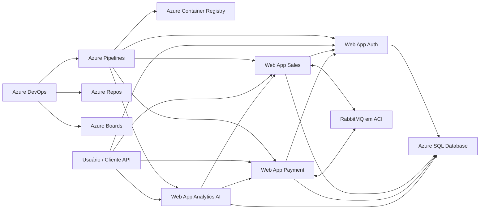

# OFFPAY

Projeto desenvolvido para manter a operação de pequenos comércios funcionando mesmo em cenários de instabilidade de rede, com arquitetura baseada em microsserviços, mensageria e abordagem offline-first.

## Integrantes do grupo

- `RM561061` - Arthur Thomas Mariano de Souza
- `RM559873` - Davi Cavalcanti Jorge
- `RM559728` - Mateus da Silveira Lima

## Problema abordado

Pequenos comércios perdem vendas quando a internet falha no momento do pedido, do pagamento ou da consulta ao catálogo. Em cenários de instabilidade, o vendedor fica sem acesso confiável aos pedidos, ao saldo da carteira e ao processamento do pagamento. Isso gera fila, retrabalho e risco operacional.

O projeto OffPay trata esse problema com uma abordagem offline-first. A operação da loja continua mesmo sem conectividade total, registrando pedidos e pagamentos localmente, mantendo evidências para sincronização posterior e reduzindo o impacto de falhas na rede.

## Objetivos da solução

- Permitir que vendedores continuem vendendo offline
- Sincronizar pedidos, catálogo e eventos quando a conectividade retornar
- Registrar pagamentos com rastreabilidade e tratamento assíncrono
- Controlar carteira financeira de clientes e lojas
- Manter trilha operacional via outbox para integração entre serviços
- Armazenar base de conhecimento para IA com chunks pesquisáveis

## Arquitetura da solução

O OffPay é composto por quatro microsserviços principais:

| Serviço | Porta | Papel |
|--------|-------|-------|
| `signal-auth-service` | `8081` | autenticação, login, JWT e identidade |
| `signal-sales-service` | `8082` | catálogo, categorias, produtos, pedidos e sincronização |
| `signal-payment-service` | `8083` | carteira, transações e processamento financeiro |
| `signal-analytics-ai-service` | `8084` | analytics, insights e respostas em linguagem natural |

## Desenho macro da arquitetura

O desenho abaixo representa a arquitetura alvo da entrega em nuvem no Azure.



## Justificativa da arquitetura de microsserviços

A arquitetura de microsserviços foi adotada porque o problema do OffPay envolve domínios distintos, com responsabilidades bem separadas e necessidades diferentes de processamento.

- o `signal-auth-service` concentra autenticação, identidade, Spring Security e JWT
- o `signal-sales-service` isola a operação comercial, catálogo, pedidos e sincronização offline-first
- o `signal-payment-service` separa a regra financeira, carteira e processamento assíncrono de pagamentos
- o `signal-analytics-ai-service` fica responsável pela leitura de contexto, consolidação de dados e uso de Spring AI

Essa divisão reduz acoplamento, facilita manutenção, melhora a clareza das responsabilidades e justifica o uso de comunicação entre serviços em uma solução com autenticação, operação comercial, pagamentos e inteligência analítica.

## Recursos técnicos aplicados na solução

- API REST com Spring Boot em todos os microsserviços
- persistência em banco de dados relacional
- controle de acesso com Spring Security e tokens JWT
- documentação com Swagger e OpenAPI
- uso de HATEOAS em endpoints selecionados
- uso de cache onde faz sentido para reduzir custo de leitura
- suporte a CORS para integração com clientes externos
- mensageria com RabbitMQ para eventos e processamento assíncrono
- uso de Feign para comunicação entre microsserviços
- uso de Spring AI no `signal-analytics-ai-service`
- funcionalidade real voltada à operação offline-first, sincronização, carteira, pagamentos e geração de insights

## Fluxo resumido

1. O usuário se autentica no `signal-auth-service`.
2. O vendedor opera catálogo e pedidos no `signal-sales-service`.
3. O `signal-payment-service` processa pagamentos e carteira.
4. O `signal-analytics-ai-service` consolida informações e gera insights.

Quando há falha de conectividade, a aplicação mantém o registro da operação e sincroniza os dados quando a rede retorna.

## Setup local

Este repositório deve ser executado como solução completa. O microsserviço de IA depende dos demais serviços para funcionar corretamente.

### Pré-requisitos

- Docker Desktop instalado
- Docker Desktop em execução
- Git instalado

### Passo a passo

1. Clone o repositório:

```bash
git clone https://github.com/challengeoracle/global-java
```

2. Entre na pasta do projeto:

```bash
cd global-java
```

3. Copie o arquivo de variáveis de ambiente:

```powershell
Copy-Item .env.example .env
```

4. Ajuste no `.env` pelo menos estas variáveis:

- `JWT_SECRET`
- `DB_URL`
- `DB_USERNAME`
- `DB_PASSWORD`
- `GROQ_API_KEY`

5. Suba todos os serviços:

```powershell
docker compose up -d --build
```

6. Acompanhe a inicialização:

```powershell
docker compose logs -f
```

### Logs locais

Ou use os atalhos:

No Windows:

```powershell
./scripts/logs.ps1
./scripts/logs.ps1 -Service signal-auth-service
```

No Linux/macOS:

```bash
./scripts/logs.sh
./scripts/logs.sh signal-auth-service
```

### Endpoints locais

- Auth: `http://localhost:8081/swagger-ui.html`
- Sales: `http://localhost:8082/swagger-ui.html`
- Payment: `http://localhost:8083/swagger-ui.html`
- Analytics AI: `http://localhost:8084/swagger-ui.html`
- RabbitMQ Management: `http://localhost:15672`

## Banco de dados

O projeto foi mantido compatível com dois cenários:

- Oracle, que continua sendo o caminho legado do projeto
- Azure SQL, que foi preparado para a entrega em nuvem

A troca entre Oracle e Azure SQL acontece por variáveis de ambiente:

- `DB_URL`
- `DB_USERNAME`
- `DB_PASSWORD`
- `DB_DRIVER_CLASS_NAME`
- `DB_DIALECT`
- `FLYWAY_LOCATIONS`

### Oracle legado

Use:

- `DB_DRIVER_CLASS_NAME=oracle.jdbc.OracleDriver`
- `DB_DIALECT=org.hibernate.dialect.OracleDialect`
- `FLYWAY_LOCATIONS=classpath:db/migration`

### Azure SQL

Use:

- `DB_DRIVER_CLASS_NAME=com.microsoft.sqlserver.jdbc.SQLServerDriver`
- `DB_DIALECT=org.hibernate.dialect.SQLServerDialect`
- `FLYWAY_LOCATIONS=classpath:db/migration-sqlserver`

## Provisionamento em nuvem com Azure CLI

Os recursos da entrega devem ser criados via script. Os arquivos obrigatórios estão em `/scripts` com prefixo `script-infra`.

### Scripts incluídos

- `scripts/script-bd.sql`
- `scripts/script-infra-base.sh`
- `scripts/script-infra-db.sh`
- `scripts/script-infra-rabbitmq.sh`
- `scripts/script-infra-webapps.sh`
- `scripts/script-infra-validate.sh`

### Ordem recomendada

1. Criar infra base:

```bash
export LOCATION=southafricanorth
export SUFFIX=rm559728
bash scripts/script-infra-base.sh
```

2. Criar Azure SQL:

```bash
export SQL_ADMIN_PASSWORD='SuaSenhaForteAqui123!'
bash scripts/script-infra-db.sh
```

3. Criar RabbitMQ:

```bash
bash scripts/script-infra-rabbitmq.sh
```

4. Criar Web Apps:

```bash
export DB_URL='jdbc:sqlserver://sql-offpay-rm559728.database.windows.net:1433;database=sqldb-offpay-rm559728;encrypt=true;trustServerCertificate=false;hostNameInCertificate=*.database.windows.net;loginTimeout=30;'
export DB_USERNAME='sqladminoffpay'
export DB_PASSWORD='SuaSenhaForteAqui123!'
export JWT_SECRET='seu-segredo-com-32-caracteres-ou-mais'
export GROQ_API_KEY='sua-chave'

bash scripts/script-infra-webapps.sh
```

5. Validar os recursos:

```bash
bash scripts/script-infra-validate.sh
```

## Azure DevOps

### Repos e Boards

Este projeto deve ser importado para um repositório privado no Azure Repos. Uma tarefa inicial deve ser criada no Azure Boards e vinculada a:

- branch
- commits
- pull request

### Políticas da branch principal

A branch `main` deve ficar protegida com:

- revisor obrigatório
- work item obrigatório
- revisor padrão
- possibilidade de autoaprovação para simulação individual

### Pipeline

O arquivo `azure-pipeline.yml` na raiz implementa:

- gatilho automático na `main`
- publicação de testes JUnit
- empacotamento dos quatro microsserviços
- build e push das quatro imagens Docker para o ACR
- publicação de artefatos da CI
- release automática após a build
- deploy automático nos quatro Web Apps

### Service Connections esperadas

Crie no Azure DevOps:

- `Conexao-Azure-DevOps`
- `Conexao-ACR`

## Estrutura DevOps

- `docker-compose.yml`: orquestração local completa
- `dockerfiles/`: Dockerfiles de cada microsserviço
- `azure-pipeline.yml`: pipeline YAML com CI e release automática
- `scripts/script-bd.sql`: DDL consolidado do banco da entrega
- `scripts/script-infra-base.sh`: cria Resource Group, ACR e App Service Plan
- `scripts/script-infra-db.sh`: cria Azure SQL Server e Azure SQL Database
- `scripts/script-infra-rabbitmq.sh`: cria RabbitMQ em Azure Container Instances
- `scripts/script-infra-webapps.sh`: cria e configura os quatro Web Apps
- `scripts/script-infra-validate.sh`: valida os recursos provisionados
- `scripts/init-local-oracle.sh`: bootstrap do banco local opcional
- `scripts/start-local.ps1`: execução facilitada no Windows
- `scripts/start-local.sh`: execução facilitada no Linux/macOS
- `scripts/logs.ps1`: visualização de logs no Windows
- `scripts/logs.sh`: visualização de logs no Linux/macOS
- `.env.example`: modelo centralizado de variáveis de ambiente

## CRUD exposto em JSON

Para a gravação e para a correção, a recomendação mais segura é demonstrar CRUD completo em:

- `TB_PRODUCT_CATEGORIES`
- `TB_PRODUCTS`

### Categoria - Create

`POST /category`

```json
{
  "name": "Bebidas",
  "description": "Categoria de bebidas da loja"
}
```

### Categoria - Read

`GET /category/me`

Sem body.

### Categoria - Update

`PUT /category/{id}`

```json
{
  "name": "Bebidas Geladas",
  "description": "Categoria atualizada para produtos refrigerados"
}
```

### Categoria - Delete

`DELETE /category/{id}`

Sem body.

### Produto - Create

`POST /product`

```json
{
  "categoryId": "11111111-1111-1111-1111-111111111111",
  "name": "Água 500ml",
  "description": "Garrafa de água sem gás",
  "price": 4.50,
  "stockQuantity": 100
}
```

### Produto - Read

`GET /product/{id}`

Sem body.

### Produto - Update

`PUT /product/{id}`

```json
{
  "categoryId": "11111111-1111-1111-1111-111111111111",
  "name": "Água 500ml Premium",
  "description": "Produto atualizado em nuvem",
  "price": 5.00,
  "stockQuantity": 120
}
```

### Produto - Delete

`DELETE /product/{id}`

Sem body.

## Validação direta no banco em nuvem

Na gravação, não use apenas `GET` para provar persistência. Execute `SELECT` diretamente no Azure SQL.

### Categoria

```sql
SELECT ID, NAME, DESCRIPTION, ACTIVE
FROM TB_PRODUCT_CATEGORIES;
```

### Produto

```sql
SELECT ID, NAME, PRICE, STOCK_QUANTITY, ACTIVE
FROM TB_PRODUCTS;
```

## Evidências para o vídeo

Na apresentação, mostre nesta ordem:

1. README e desenho da arquitetura
2. Recursos criados no Portal Azure
3. Nova tarefa no Azure Boards
4. Nova branch
5. Alteração real em código fonte
6. Pull Request e merge na `main`
7. Pipeline de Build
8. Artefatos e testes publicados
9. Pipeline de Release
10. Aplicação atualizada em nuvem
11. CRUD de duas tabelas
12. `SELECT` no banco em nuvem
13. Task final com links de branch, commit e PR
