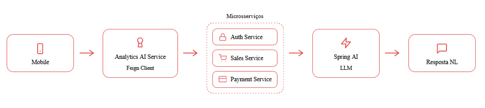

# OFFPAY Insights

Serviço de analytics e IA generativa da solução OffPay. Este microsserviço consolida dados operacionais dos demais serviços e responde perguntas em linguagem natural sobre vendas, pagamentos, carteira digital, consumo do cliente e contexto de sincronização offline.



## Integrantes

- `RM561061` - Arthur Thomas Mariano de Souza
- `RM559873` - Davi Cavalcanti Jorge
- `RM559728` - Mateus da Silveira Lima

## Vídeo demonstrativo

Link do vídeo no YouTube não listado: `COLE_AQUI_O_LINK_DO_VIDEO`

## Objetivo do projeto

O OFFPAY Insights transforma dados operacionais em análises compreensíveis para clientes e vendedores. Usando IA generativa com Spring AI, o serviço responde perguntas em linguagem natural e apresenta indicadores relevantes para apoiar decisões rápidas após períodos de operação offline ou instabilidade de rede.

## Problema resolvido

Após operar offline, comerciantes e clientes precisam entender com clareza o que aconteceu no sistema:

- quanto foi vendido no período
- quais produtos tiveram maior saída
- quais pagamentos foram aprovados ou recusados
- qual saldo está disponível ou pendente
- o que já foi sincronizado entre os serviços

O OFFPAY Insights centraliza essas respostas em um único ponto, reduzindo a necessidade de navegar por múltiplas APIs manualmente.

## Como a solução funciona

O serviço consulta os microsserviços do ecossistema OffPay via Feign Client, agrega dados do usuário autenticado e complementa o contexto com regras operacionais extraídas de um PDF de conhecimento local. A resposta final é gerada por um modelo LLM acessado via API compatível com OpenAI, configurada neste projeto com a Groq.

Esta implementação não utiliza RAG vetorial. A decisão foi técnica: o ambiente proposto com Oracle não oferece suporte vetorial nativo no cenário adotado pela entrega. Por isso, a base de conhecimento foi modelada com ingestão de PDF e recuperação textual por trechos persistidos em banco, mantendo a solução funcional, explicável e compatível com a infraestrutura disponível.

## Arquitetura da solução

### Visão geral

```text
Cliente autenticado
        |
        v
OFFPAY Insights (8084)
        |
        +--> Auth Service (8081)     -> perfil do usuário e loja vinculada
        +--> Sales Service (8082)    -> pedidos, compras, vendas e produtos
        +--> Payment Service (8083)  -> carteira, saldo e transações
        +--> Base de conhecimento    -> regras do negócio em PDF
        |
        v
Spring AI + Groq
        |
        v
Resposta em linguagem natural + indicadores analíticos
```

### Componentes principais

- `AnalyticsController`: expõe os endpoints REST de resumo, gráficos e indicadores.
- `InsightAiController`: recebe perguntas em linguagem natural no endpoint de IA.
- `AnalyticsSummaryService`: consolida métricas a partir dos serviços de vendas e pagamento.
- `KnowledgeRetrievalService`: busca trechos relevantes da documentação operacional.
- `PdfKnowledgeIngestionService`: carrega o conteúdo do PDF para a base consultável.
- `OffPayMcpServer`: expõe recursos e ferramentas via MCP no mesmo processo.

### Dados consultados

- `Auth Service`: perfil do usuário autenticado e loja vinculada
- `Sales Service`: pedidos, compras, vendas, catálogo e itens vendidos
- `Payment Service`: carteira, saldo disponível, saldo pendente e transações
- `Base local de conhecimento`: regras operacionais do OffPay extraídas do PDF

## Exemplos de uso

### Vendedor

Pergunta:

```text
Quanto vendi hoje?
```

Resposta esperada:

```text
Hoje sua loja vendeu R$ 67,42 em 22 pedidos. O produto mais vendido foi Figurinha Copa do Mundo 2026, com 15 unidades.
```

### Cliente

Pergunta:

```text
Quanto gastei este mês?
```

Resposta esperada:

```text
Você gastou R$ 420,69 em 13 pedidos. A loja mais frequente foi o Mercado Car.
```

## Endpoints principais

### Analytics

- `GET /analytics/me/summary`
- `GET /analytics/me/summary/resource`
- `GET /analytics/me/summary/period`
- `GET /analytics/me/chart`
- `GET /analytics/seller/summary`
- `GET /analytics/seller/top-products`
- `GET /analytics/seller/chart`
- `GET /analytics/customer/summary`
- `GET /analytics/customer/spending`
- `GET /analytics/customer/chart`

### IA generativa

- `POST /ai/insights/ask`

### Swagger local

```text
http://localhost:8084/swagger-ui/index.html
```

## Tecnologias utilizadas

- Java 21
- Spring Boot 3
- Spring Web
- Spring Security com JWT
- Spring Cloud OpenFeign
- Spring AI
- Springdoc OpenAPI
- Spring Data JPA
- Flyway
- Oracle ou Azure SQL
- Docker e Docker Compose
- Groq API

## Configuração do ambiente

As principais variáveis utilizadas pelo serviço são:

```env
SERVER_PORT=8084
JWT_SECRET=
JWT_EXPIRATION_MINUTES=120
DB_URL=
DB_USERNAME=
DB_PASSWORD=
DB_DRIVER_CLASS_NAME=oracle.jdbc.OracleDriver
DB_DIALECT=org.hibernate.dialect.OracleDialect
FLYWAY_LOCATIONS=classpath:db/migration
AUTH_SERVICE_URL=http://signal-auth-service:8081
SALES_SERVICE_URL=http://signal-sales-service:8082
PAYMENT_SERVICE_URL=http://signal-payment-service:8083
GROQ_API_KEY=
GROQ_BASE_URL=https://api.groq.com/openai
GROQ_MODEL=llama-3.1-8b-instant
AI_TEMPERATURE=0.2
AI_MAX_TOKENS=160
AI_RETRIEVAL_MAX_CHUNKS=3
AI_RULES_PDF_PATH=classpath:knowledge/offpay_rules.pdf
AI_MCP_SERVER_NAME=offpay-insights-mcp
AI_MCP_SERVER_VERSION=1.0.0
```

## Instruções de execução

Este serviço depende do ecossistema completo do OffPay. Para validação correta, a execução recomendada é pela raiz do repositório.

### Pré-requisitos

- Docker Desktop
- Java 21
- Maven Wrapper do projeto
- arquivo `.env` configurado na raiz do repositório

### Execução completa com Docker

Na raiz do projeto:

```powershell
docker compose up -d --build
```

Para acompanhar os logs:

```powershell
docker compose logs -f signal-analytics-ai-service
```

Para derrubar o ambiente:

```powershell
docker compose down
```

### Execução com Oracle local

Se a proposta for rodar o ambiente o mais local possível, suba também o banco Oracle do `docker compose` usando o profile `local-db`:

```powershell
docker compose --profile local-db up -d --build
```

Nesse cenário, o `.env` deve apontar para o banco local em vez de um host remoto.

### Endereços locais

- Analytics API: `http://localhost:8084`
- Swagger: `http://localhost:8084/swagger-ui/index.html`
- Auth Swagger: `http://localhost:8081/swagger-ui/index.html`
- Sales Swagger: `http://localhost:8082/swagger-ui/index.html`
- Payment Swagger: `http://localhost:8083/swagger-ui/index.html`
- RabbitMQ Management: `http://localhost:15672`

## Segurança e autenticação

Todos os endpoints principais do serviço exigem token JWT no header `Authorization`. O token é emitido pelo `signal-auth-service` e reutilizado pelo serviço de analytics para identificar o usuário autenticado e filtrar os dados corretos.

## Critérios de documentação da entrega

Este README cobre os pontos pedidos para submissão no Portal:

- documentação funcional e técnica do serviço
- descrição da arquitetura da solução
- instruções de execução local
- espaço reservado para o vídeo demonstrativo no YouTube

Se necessário, este documento pode ser complementado com o README da raiz do repositório para apresentar a visão completa dos quatro microsserviços da solução OffPay.
